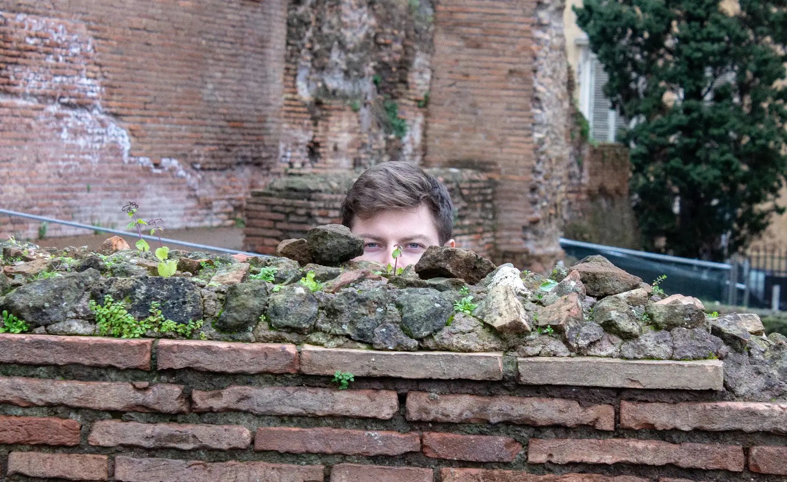
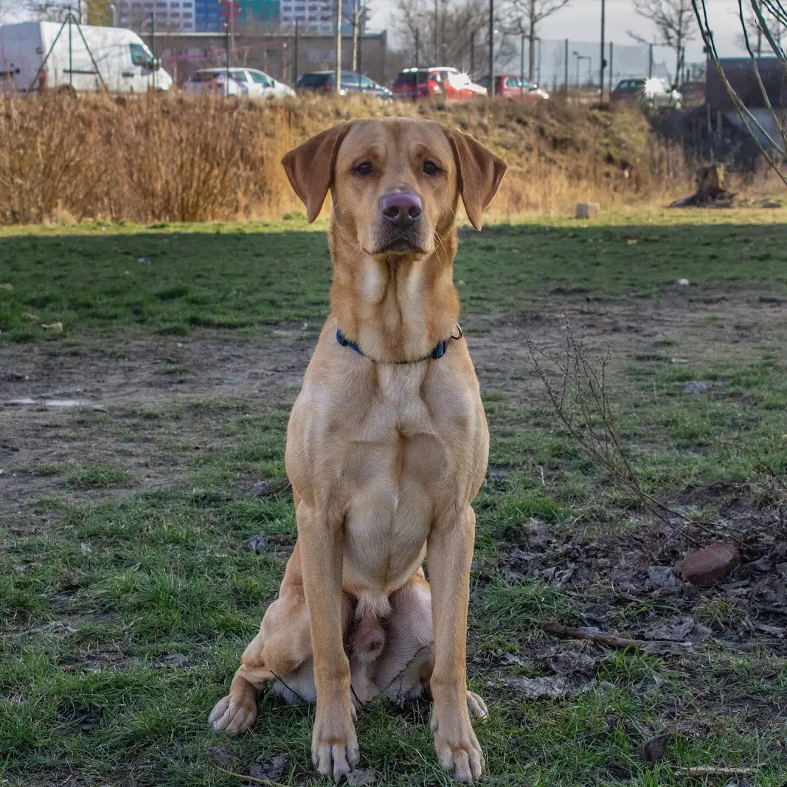
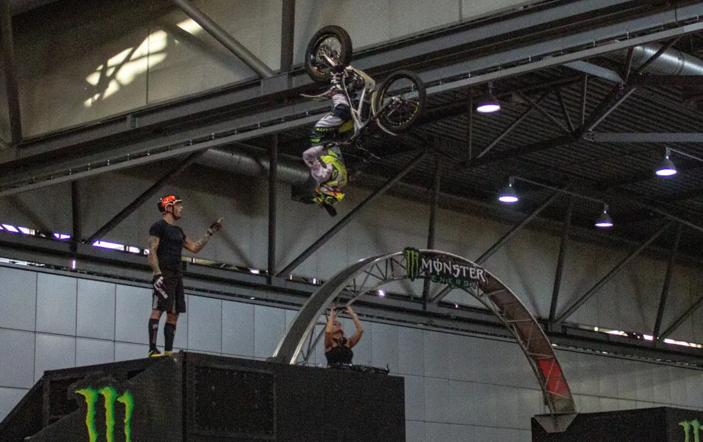
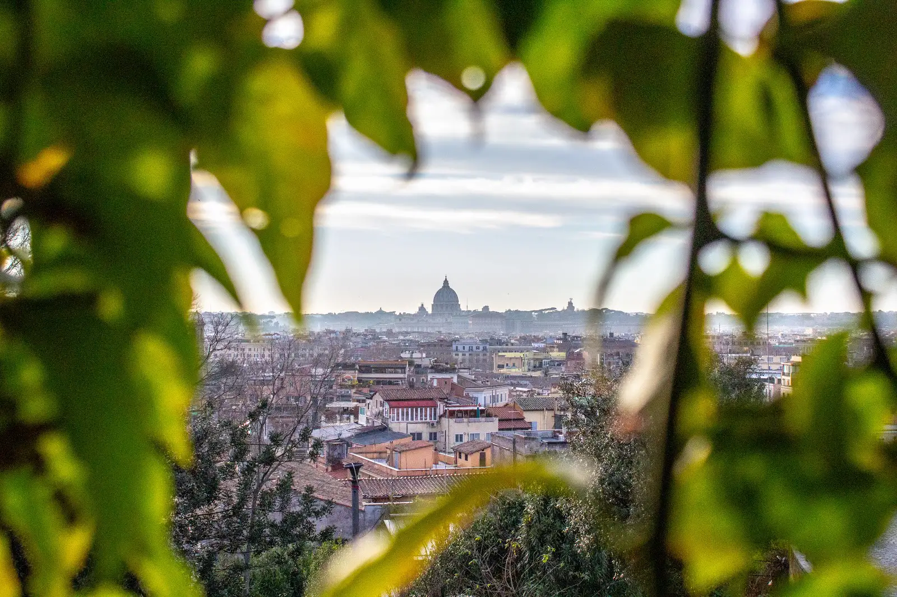

<!-- Main -->

<!-- One -->
<section id="one">
	

		<header class="major">
			<h2>Would you just look at it?</h2>
		</header>
		
In January of 2019 I resolved to more intentionally pursue my dream of becoming a Sports & Outdoors photographer and filmographer. Here you will find my collections of albums that I've created along that journey. If you see something you like, or would like to reach out, fill out the form at the bottom of the page.

	

</section>

<!-- Two -->
<section id="two" class="spotlights">
	<section>
		
		

			

				<header class="major">
					<h3>People</h3>
				</header>
				
The wonderful people in my life, and some of their experiences that I've captured...

				<ul class="actions">
					<li><a href="people.html" class="button">To People</a></li>
				</ul>
			

		

	</section>
	<section>
		
		

			

				<header class="major">
					<h3>Wildlife & Outdoors</h3>
				</header>
				
Stop and smell the roses, will ya?

				<ul class="actions">
					<li><a href="wild.html" class="button">To the great Outdoors</a></li>
				</ul>
			

		

	</section>
	<section>
		
		

			

				<header class="major">
					<h3>Action & Sports</h3>
				</header>
				
One day I hope to work for Red Bull; this is an omage to the awesome feats they capture...

				<ul class="actions">
					<li><a href="sport.html" class="button">Send it</a></li>
				</ul>
			

		

	</section>
	<section>
		
		

			

				<header class="major">
					<h3>Urban</h3>
				</header>
				
Concrete, in all its beautiful forms...

				<ul class="actions">
					<li><a href="urban.html" class="button">To Urban</a></li>
				</ul>
			

		

	</section>
</section>

<!-- Three -->
<section id="three">
	

		<header class="major">
			<h2>Looking for a Photographer?</h2>
		</header>
		
If you are looking for someone to photograph your event, sport, or gathering, fill out the contact form below and I will contact you as soon as possible!

	

</section>

