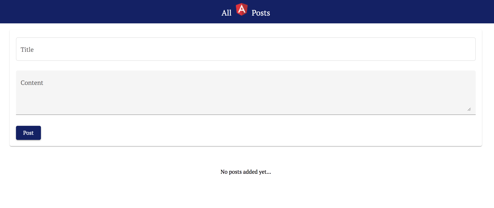

<!-- Main -->

<!-- one -->
<section id="one" class="spotlights">
	<section>
		
		

			

				<header class="major">
					<h3>Personal Site</h3>
				</header>
				
This site itself have been a fun and interesting catalyst to my interest in web development. Currently built using the <i>Jekyll</i> static site generator, it has proved a useful playground for familiarizing myself with the concepts of JavaScript, Liquid, CSS3, and Web Optimization.

				<ul class="actions">
					<li><a href="index.html" class="button">To Homepage</a></li>
					<li><a href="https://github.com/tristengeven/tristeneven.com" target="_blank" class="button">GitHub Repository</a></li>
				</ul>
			

		

	</section>
	<section>
		
		

			

				<header class="major">
					<h3>UT Dallas Rugby Site</h3>
				</header>
				
Being an Engineering University, many of the UTD Rugby team members are engineers. This site is a sandbox of sorts for us to collaborate, try out ideas, and learn in a way that also benefits our team. This simple site currently uses a basic Open Source UI Kit for Bootstrap 4, React, Vue.js, React Native and Sketch.

				<ul class="actions">
					<li><a href="https://www.utdallasrugby.org/" class="button">Visit site</a></li>
					<li><a href="https://github.com/tristengeven/UTDallasRugby.github.io" target="_blank" class="button">GitHub Repository</a></li>
				</ul>
			

		

	</section>
	<section>
		
		

			

				<header class="major">
					<h3>MEAN Stack Webapp</h3>
				</header>
				
This project creates a mock "Social Network" using the MEAN tech stack. I find the component architecture of Angular very intuitive, and really enjoyed using it. This was my first use of Node as well, which I also found enjoyable.

				<ul class="actions">
					<li><a href="https://evenmean.netlify.com" class="button">Visit site</a></li>
					<li><a href="https://github.com/tristengeven/evenmean" target="_blank" class="button">GitHub Repository</a></li>
				</ul>
			

		

	</section>
</section>