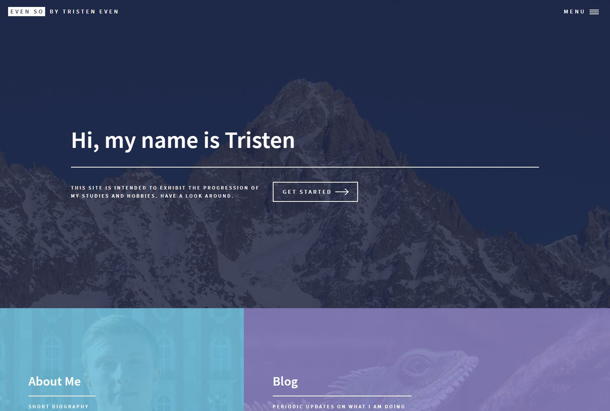

<!-- Main -->

<!-- One -->
<section id="one">
	

		<header class="major">
			<h2>What to do</h2>
		</header>
		
Post personal projects (meaning first start personal projects so that you can post them)

	

</section>

<!-- Two -->
<section id="two" class="spotlights">
	<section>
		
		

			

				<header class="major">
					<h3>Personal Site</h3>
				</header>
				
My biggest project right now is this site (meta, right?), but there will be more to come as I get this off the ground. I know this page is currently lackluster, but hold tight.

				<ul class="actions">
					<li><a href="index.html" class="button">Take me home</a></li>
				</ul>
			

		

	</section>
	<section>
		
		

			

				<header class="major">
					<h3>Project 2</h3>
				</header>
				
Quality description

				<ul class="actions">
					<li><a href="generic.html" class="button">Learn more</a></li>
				</ul>
			

		

	</section>
	<section>
		
		

			

				<header class="major">
					<h3>Project 3</h3>
				</header>
				
Quality description

				<ul class="actions">
					<li><a href="wildlife.html" class="button">Take me there</a></li>
				</ul>
			

		

	</section>
</section>